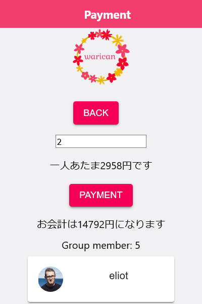
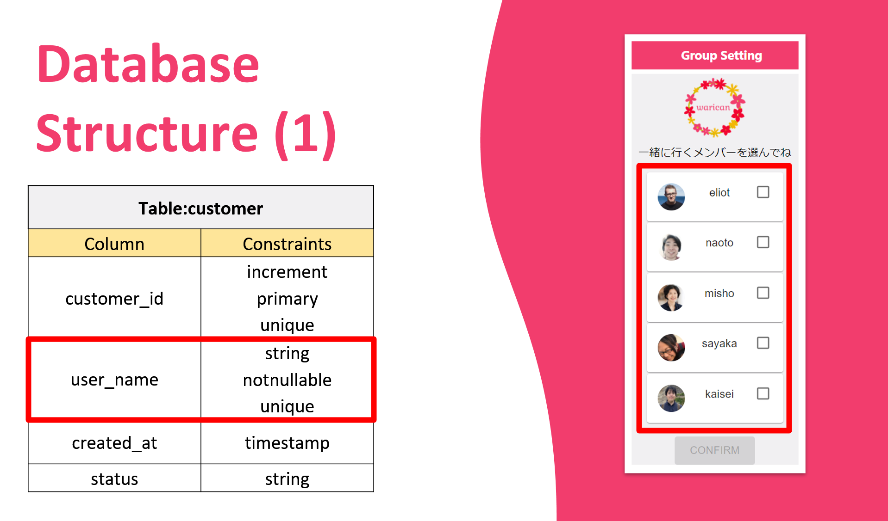
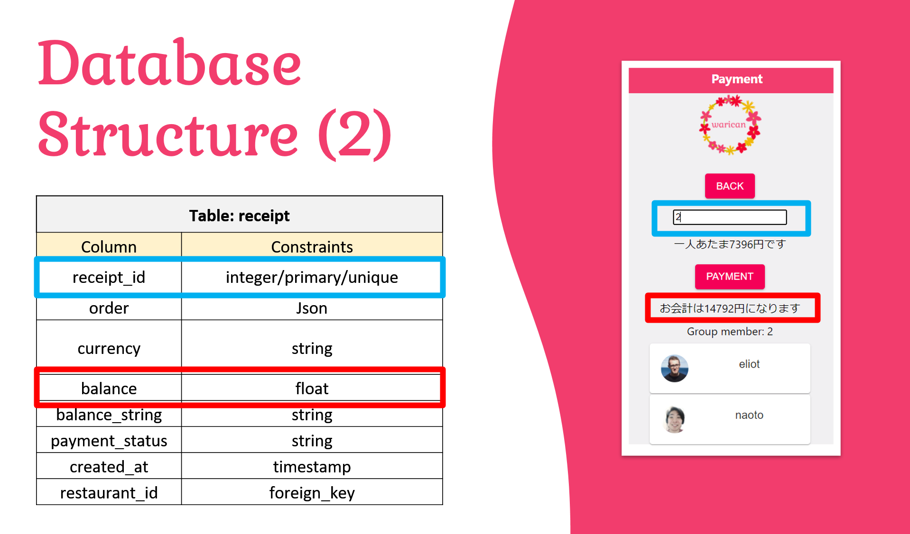
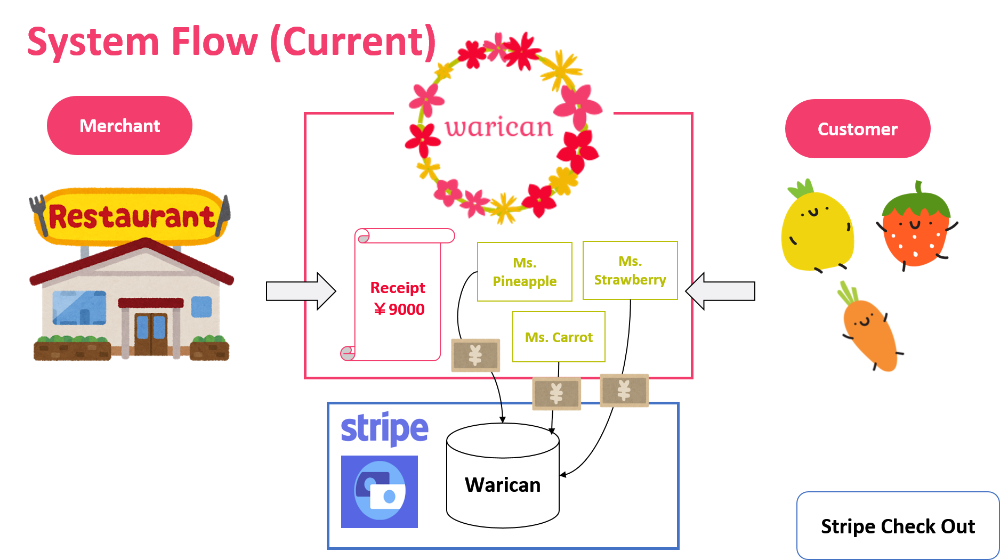
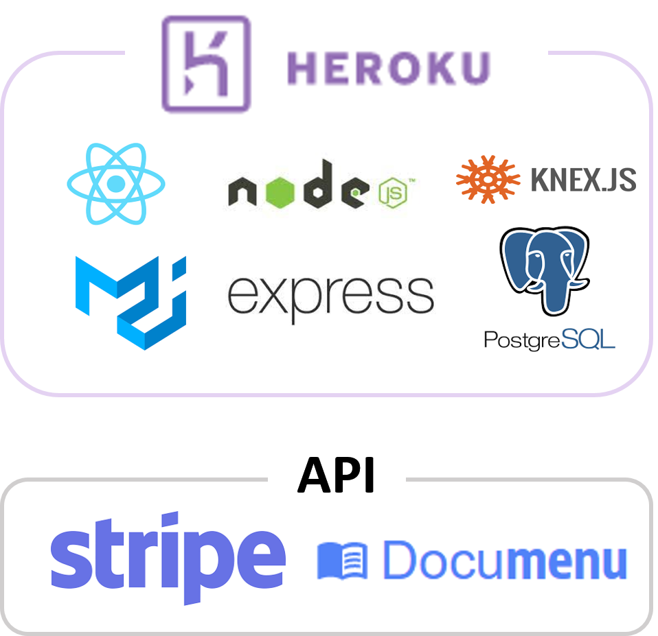
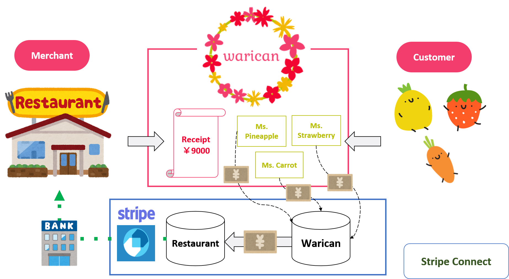

*This repository was created during our time as students at Code Chrysalis.
 

 
<h1 align="center">Warican</h1> 

<strong>The ultimate smartphone application for people who love to eat out but don't want the hassle of splitting the bill.</strong>
 

## 1. Name

---

The name warican comes from a Japanese word, warikan（割り勘）, which means splitting the payment. The use of "can" in the name indicates users can indeed split the bill without any hassle.
 
 

## 2. Usage

---

Using Warican on the smartphone, users can easily split the bill of the meal they share with friends. 

First, the users set up a group by clicking on the icons of the people they are with.  

 
Click on the confirm button.  

 
The users enter the id of the bill the restaraunt issues. When they do, they see the amount each of them needs to pay and also the total amount.  

 
Hit the payment button to jump to a payment page and enter email address and credit card information to pay.  

That's it! The bill is split.

No more calculating how much money each person must pay, going around the table to collect money, or worrying about the change!
 
 

## 4. How it works

---

The way the application works is as follows. First, the warican server keeps the data of restaurants and users who have signed up for the service. 

If a group of service users wants to split a bill, they first sign in the service and click on the friends they are eating with on the friends list. The friend list that users see is created using the data in the table:customer in the database.

This user action tells the application how many users are going to share a bill.

When the users input the id of the bill, the application will go get the data about the transaction from the table:receipt. (The restaurant has already entered the data in the system.) 

The data from the table:receipt include the total balance, the application use that information and calculates how much each person needs to pay based on the number of the users.

With a click of a button, the application directs the user to the payment page of Stripe Checkout. Stripe provides the payment compliance. And the payment is made to the stripe account. Once the payment is done on that page, the user is brought back to the application's success page.  

  

## 5. Technology used

---

This software was built with the following technologies. 

 

## 6. Future features

---
 

For this stage, we implemented the core of the service, but to realize the project goal, we envision to:

- Login / register function.

- Deploy Stripe Connect for fund transfer to Merchants

- Flexibility to adjust each person's payment amount and recalculate other people's amount automatically

- Notification of payment status to both users and merchants

 

## 7. Authors 

---

Co-authors of this application

- Eliot Austin-Forbes
- Naoto Maeda
- Sayaka Nakajima
- Kaisei Suzuki
- Mio Maeshima
   
   

## 8. Acknowledgments

---

We are indebted to the genuine support and insightful advice by . . .  

- Rafael Viana 
- Eriko Kidera 
- Yusuke Yamada 

 

## 9. Liecense

---
- MIT
